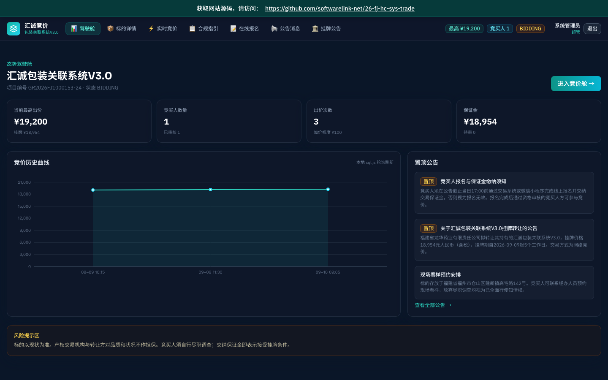

# 汇诚包装关联系统V3.0

 **上线主域名**：https://26-fj-hc-sys-trade.softwarelink.net/
 **项目仓库**：https://github.com/softwarelink-net/26-fj-hc-sys-trade



## 项目简介
本项目为**福建省龙华药业有限责任公司**持有的**汇诚包装关联系统V3.0**国有产权转让提供的**竞价展示与交易辅助平台**。平台基于 Vue 3 + Vite + Tailwind CSS 构建，采用纯前端架构，通过 sql.js 在浏览器端实现数据本地化管理与模拟交互，确保高可用、低延迟的竞价体验。

## 部署与运行说明

### 环境要求
- Node.js >= 18.0.0
- npm >= 9.0.0 或 pnpm >= 8.0.0

### 依赖安装
```bash
npm install
# 或
pnpm install
```

### 初始化本地数据库
```bash
npm run db:init
```

### 本地运行
```bash
npm run dev
```
访问 `http://localhost:3000` 即可查看本地开发服务器。

### 演示账号密码表
| 角色 | 用户名 | 密码 | 备注 |
| :--- | :--- | :--- | :--- |
| 超管 | admin | admin123 | 拥有所有权限 |
| 业务主管 | manager | manager123 | 可管理标的信息 |
| 基层经办 | operator | operator123 | 处理日常咨询 |
| 竞买人 | bidder | bidder123 | 仅查看与参与竞价 |

### 常用 npm 脚本
- `npm run dev`: 启动本地开发服务器
- `npm run build`: 生产环境构建
- `npm run preview`: 预览生产构建结果
- `npm run lint`: 代码风格检查
- `npm run db:init`: 根据 schema.sql 生成浏览器端 SQLite
- `npm run deploy`: 构建并上传至 R2（allworld-sites）

### 完整目录结构
```
26-fj-hc-sys-trade/
├── docs/
│   └── assets/          # 静态资源（图片、PDF预览等）
├── public/
│   └── favicon.ico
├── src/
│   ├── assets/          # 动态导入资源
│   ├── components/      # 公共组件
│   │   ├── BidCockpit.vue      # 竞价交互舱
│   │   ├── ComplianceGuide.vue # 合规指引
│   │   └── GlobalStickyBanner.vue # 全局粘性横幅
│   ├── composables/     # 组合式函数
│   │   └── useBidding.ts     # 竞价逻辑
│   ├── layouts/         # 布局组件
│   │   ├── AuthLayout.vue    # 认证布局（登录/注册）
│   │   └── MainLayout.vue    # 主应用布局（导航/侧边栏）
│   ├── router/          # 路由配置
│   │   └── index.ts
│   ├── stores/          # Pinia 状态管理
│   │   ├── user.ts
│   │   └── bid.ts
│   ├── views/           # 页面视图
│   │   ├── Dashboard.vue   # 控制台
│   │   ├── AssetDetail.vue # 标的详情
│   │   ├── Bidding.vue     # 竞价页面
│   │   └── Login.vue       # 登录页
│   ├── App.vue
│   └── main.ts
├── index.html
├── package.json
├── vite.config.ts
└── tsconfig.json
```

## 招标公告全文

- **标题**：汇诚包装关联系统V3.0 产权转让公告
- **项目发包方**：福建省龙华药业有限责任公司
- **项目编号**：GR2026FJ1000153-24
- **项目发布时间**：2026-09-09
- **关键词**：福建省产权交易中心, 国有产权, 网络竞价, 汇诚包装, 关联系统, 挂牌披露
- **摘要**：福建省龙华药业有限责任公司拟转让其持有的汇诚包装关联系统V3.0，挂牌价格18,954元，通过福建省产权交易中心交易系统实施网络竞价。竞买人需在线报名、缴纳保证金并参与竞价，标的以现状为准，竞买人需自行尽职调查。
- **技术要点**：
    - 交易系统：https://biz.fjcqjy.com/#/login
    - 支持微信小程序报名
    - 截止日当日17:00前完成报名与缴保
    - 全程网络竞价，无报价则保证金不退
- **技术创新性**：
    - 采用纯前端技术栈模拟高并发竞价环境，提升用户交互体验。
    - 集成智能合规指引，将法律条款结构化，降低竞买人决策成本。
    - 实时状态同步，确保竞价过程的透明性与公正性。

## 免责声明

1. **数据来源与合规性**：本项目所涉数据信息均采集自互联网公开渠道发布的标讯公示信息。项目开发者严格遵守《中华人民共和国数据安全法》及相关法律法规，确保数据来源合法、公开、可查询。
2. **技术实现路径**：本项目核心内容系基于国产大语言模型进行算法推演与自动化构造生成，非直接引用或复制原始招标文件。
3. **保密承诺**：本项目郑重承诺：不涉及、不包含任何国家秘密、商业秘密或未公开的敏感信息。所有生成内容均基于公开数据的逻辑推演。
4. **知识产权与巧合声明**：鉴于本项目内容均由AI模型基于公开数据推演生成，若生成内容在表述方式、结构逻辑上与任何第三方原始标书文件存在相似之处，纯属技术通用设计之巧合，不构成对任何第三方著作权的侵犯或商业秘密的泄露。本项目不保证生成内容的准确性与完整性，仅供技术研究与学习参考。
5. **免责条款**：任何单位或个人使用本项目代码及生成内容所产生的一切后果，均由使用者自行承担，项目开发者不承担任何法律责任。
